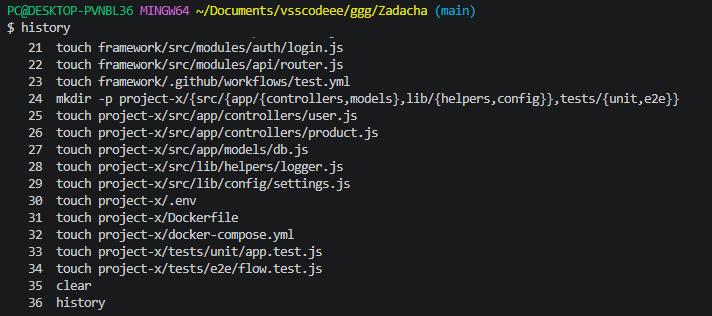

Сдвинуть вверх лог выполненных ранее команд

**Crtl-L**

или с очисткой всего лога

```shell
clear
```


Сбросить настройки терминала и очищает экран
```shell
reset
```


```shell
history
```


Выполнить нужную коману из списка **History**
```shell
!35
```


где **35**  - это № команды из списка

Выполнить предыдущую команду
```shell
!!
```


Автодополнение команд выполнятся по `TAB`

Прервать выполнение запущенной команды

`Ctrl+C`

### Файловые операции

Показать путь текущей директории
```shell
pwd
```


Показать содержимое текущего каталога
```shell
ls
```


Показать содержимое указанного каталога
```shell
ls shop
```


Показать подробное содержимое текущего каталога
```shell
ll
```
или
```shell
ls --all
```


Показать подробное содержимое указанного каталога
```shell
ll dir_name
```


Показать содержимое в виде дерева
```shell
tree
```


Вернуться в домашний каталог текущего пользователя
```shell
cd ~
```


Вернуться в предыдущую папку
```shell
cd -
```


**/** - знак корня директории

**~** - знак домашнего каталога пользователя

Зайти в нужный каталог
```shell
cd dir_name
```


где `dir_name` - это имя нужного вам каталога

Выйти из текущего каталога на 1 шаг вверх
```shell
cd ..
```


Выйти из текущего каталога на 2 шага вверх
```shell
cd ../..
```


### Linux

Показать версию Linux
```shell
lsb_release -a
```


Показать красивую ин-фу по системе
```shell
neofetch
```


Показать подробную ин-фу по системе
```shell
inxi -F
```


Показать ин-фу о текущем пользователе
```shell
w
```


или
```shell
id
```


Показать время
```shell
date
```

