#  Самостоятельная работа по Bash

##  Задание 1: Простая структура блога

**Цель:** Создать структуру для блога с основными разделами.

```bash
mkdir -p blog/{posts,pages,images,css,js}
```

**Результат:**

```text
blog/
├── posts/
├── pages/
├── images/
├── css/
└── js/
```

---

##  Задание 2: Двухуровневая структура интернет-магазина

**Цель:** Создать структуру интернет-магазина с вложенными категориями.

```bash
mkdir -p shop/{products/{electronics,clothing},users/profiles,orders}
```

**Результат:**

```text
shop/
├── products/
│   ├── electronics/
│   └── clothing/
├── users/
│   └── profiles/
└── orders/
```

---

##  Задание 3: Структура веб-проекта с файлами

**Цель:** Создать структуру веб-приложения с файлами.

```bash
mkdir -p webapp/{css,js,images/icons,pages}
touch webapp/css/style.css
touch webapp/js/script.js
touch webapp/images/logo.png
touch webapp/images/icons/favicon.ico
touch webapp/pages/about.html
touch webapp/index.html
```

**Результат:**

```text
webapp/
├── css/
│   └── style.css
├── js/
│   └── script.js
├── images/
│   ├── logo.png
│   └── icons/
│       └── favicon.ico
├── pages/
│   └── about.html
└── index.html
```

---

##  Задание 4: Проект с шаблонами и конфигами

**Цель:** Создать структуру фреймворка с конфигурациями и модулями.

```bash
mkdir -p framework/{src/{core/{config,helpers},modules/{auth,api}},tests/{unit,integration},docs,.github/workflows}
touch framework/src/core/config/settings.json
touch framework/src/core/helpers/utils.js
touch framework/src/modules/auth/login.js
touch framework/src/modules/api/router.js
touch framework/.github/workflows/test.yml
```

**Результат:**

```text
framework/
├── src/
│   ├── core/
│   │   ├── config/
│   │   │   └── settings.json
│   │   └── helpers/
│   │       └── utils.js
│   └── modules/
│       ├── auth/
│       │   └── login.js
│       └── api/
│           └── router.js
├── tests/
│   ├── unit/
│   └── integration/
├── docs/
└── .github/
    └── workflows/
        └── test.yml
```

---

##  Задание 5: Генерация структуры по описанию

**Цель:** Создать структуру по текстовому описанию.

```bash
mkdir -p project-x/{src/{app/{controllers,models},lib/{helpers,config}},tests/{unit,e2e}}
touch project-x/src/app/controllers/user.js
touch project-x/src/app/controllers/product.js
touch project-x/src/app/models/db.js
touch project-x/src/lib/helpers/logger.js
touch project-x/src/lib/config/settings.js
touch project-x/.env
touch project-x/Dockerfile
touch project-x/docker-compose.yml
touch project-x/tests/unit/app.test.js
touch project-x/tests/e2e/flow.test.js
```

**Результат:**

```text
project-x/
├── src/
│   ├── app/
│   │   ├── controllers/
│   │   │   ├── user.js
│   │   │   └── product.js
│   │   └── models/
│   │       └── db.js
│   └── lib/
│       ├── helpers/
│       │   └── logger.js
│       └── config/
│           └── settings.js
├── tests/
│   ├── unit/
│   │   └── app.test.js
│   └── e2e/
│       └── flow.test.js
├── .env
├── Dockerfile
└── docker-compose.yml
```

---

Сдвинуть вверх лог выполненных ранее команд

**Crtl-L**

или с очисткой всего лога

```shell
clear
```
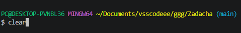

Сбросить настройки терминала и очищает экран
```shell
reset
```
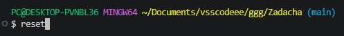

```shell
history
```


Выполнить нужную коману из списка **History**
```shell
!35
```
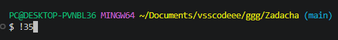

где **35**  - это № команды из списка

Выполнить предыдущую команду
```shell
!!
```
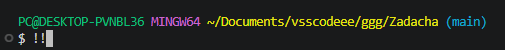

Автодополнение команд выполнятся по `TAB`

Прервать выполнение запущенной команды

`Ctrl+C`

### Файловые операции

Показать путь текущей директории
```shell
pwd
```
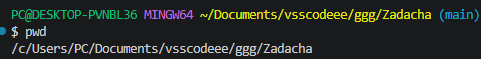

Показать содержимое текущего каталога
```shell
ls
```
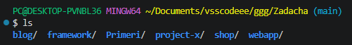

Показать содержимое указанного каталога
```shell
ls shop
```
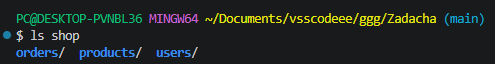

Показать подробное содержимое текущего каталога
```shell
ll
```
или
```shell
ls --all
```
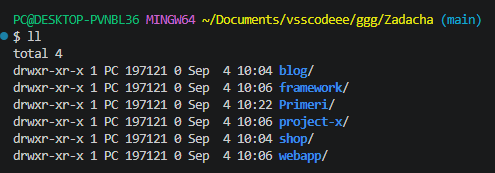

Показать подробное содержимое указанного каталога
```shell
ll dir_name
```
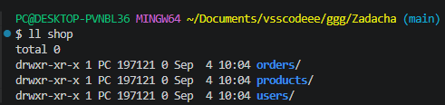

Показать содержимое в виде дерева
```shell
tree
```
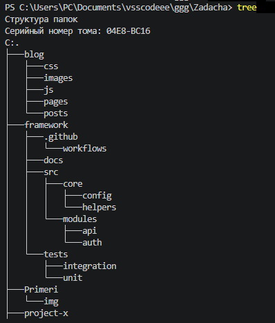

Вернуться в домашний каталог текущего пользователя
```shell
cd ~
```
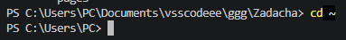

Вернуться в предыдущую папку
```shell
cd -
```
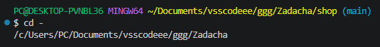

**/** - знак корня директории

**~** - знак домашнего каталога пользователя

Зайти в нужный каталог
```shell
cd dir_name
```
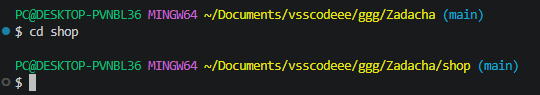

где `dir_name` - это имя нужного вам каталога

Выйти из текущего каталога на 1 шаг вверх
```shell
cd ..
```
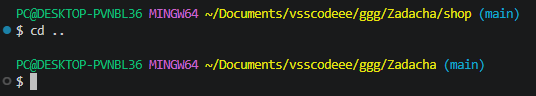

Выйти из текущего каталога на 2 шага вверх
```shell
cd ../..
```
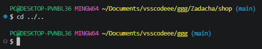

### Linux

Показать версию Linux
```shell
lsb_release -a
```
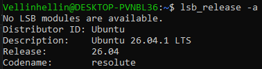

Показать красивую ин-фу по системе
```shell
neofetch
```
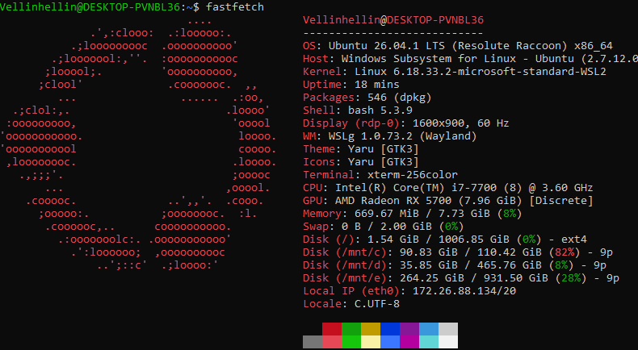

Показать подробную ин-фу по системе
```shell
inxi -F
```
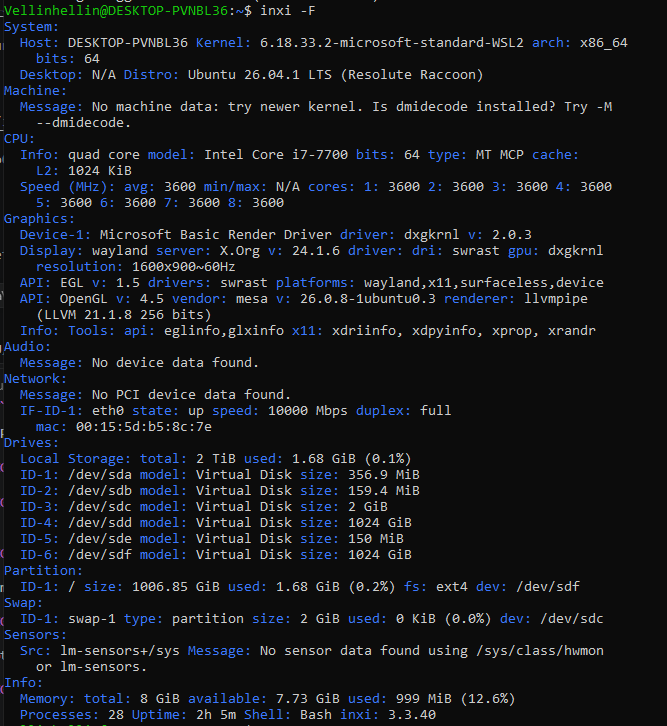

Показать ин-фу о текущем пользователе
```shell
w
```
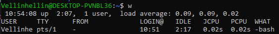

или
```shell
id
```
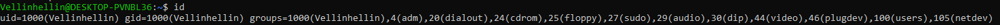

Показать время
```shell
date
```

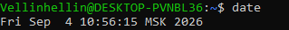
> Если вы обнаружили ошибку в этом тексте - сообщите пожалуйста автору!
