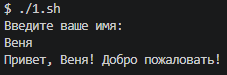
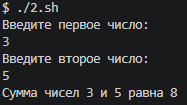
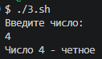
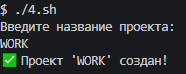
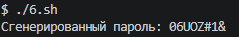
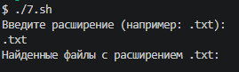

# 🐚 Самостоятельная работа по Bash программированию

## 📋 Описание проекта
Этот репозиторий содержит решения 10 заданий по Bash программированию. Все скрипты разработаны для выполнения в среде Linux/Unix и Git-Bash (Windows), протестированы и готовы к использованию. Проект создан в рамках учебного курса по Bash программированию.

## 📂 Структура репозитория
bash-scripts/
├── 1.sh # Приветствие пользователя
├── 2.sh # Калькулятор суммы
├── 3.sh # Проверка четности числа
├── 4.sh # Создатель структуры веб-проекта
├── 5.sh # Счетчик строк в файле
├── 6.sh # Генератор паролей
├── 7.sh # Поиск файлов по расширению
├── github-stats-simple.sh # Анализ популярных репозиториев GitHub
└── README.md # Описание проекта

text

## 🛠️ Требования для запуска
- **Git Bash** (для Windows) или **Linux/Mac терминал**
- Права на выполнение скриптов (`chmod +x *.sh`)
- **curl** (уже установлен в Git Bash)
- Интернет-соединение (для github-stats-simple.sh)

## 📝 Подробное описание заданий

### 1. Приветствие пользователя (`1.sh`)
Скрипт запрашивает имя пользователя и выводит персонализированное приветствие.

**Пример использования:**

$ ./1.sh
Введите ваше имя: Алексей
Привет, Алексей! Добро пожаловать!

2. Калькулятор суммы (2.sh)
Скрипт запрашивает два числа и выводит их сумму.

Пример использования:

bash
$ ./2.sh
Введите первое число: 15
Введите второе число: 30
Сумма чисел 15 и 30 равна 45

3. Проверка четности (3.sh)
Скрипт определяет, является ли число четным или нечетным.

Пример использования:

bash
$ ./3.sh
Введите число: 7
Число 7 - нечетное

4. Создатель структуры веб-проекта (4.sh)
Создает полную структуру папок и файлов для веб-проекта с базовым содержимым.

Пример использования:

bash
$ ./4.sh
Введите название проекта: my-website
✅ Проект 'my-website' создан!
Создаваемая структура:

text
my-website/
├── index.html          # Базовая HTML-страница
├── css/
│   └── style.css       # Базовый CSS-файл
└── js/
    └── script.js       # Базовый JavaScript-файл

5. Счетчик строк в файле (5.sh)
Подсчитывает количество строк в указанном пользователем файле.

Пример использования:

bash
$ ./5.sh
Введите путь к файлу: README.md
Файл README.md содержит 45 строк
6. Генератор паролей (6.sh)
Генерирует случайный пароль длиной 8 символов (буквы разного регистра, цифры, спецсимволы).

Пример использования:

bash
$ ./6.sh
Сгенерированный пароль: aB3#dF8k

или

7. Поиск файлов по расширению (7.sh)
Ищет все файлы с указанным расширением в текущей директории и подпапках.

Пример использования:

bash
$ ./7.sh
Введите расширение файла: .txt
Найденные файлы с расширением .txt:
- notes.txt
- readme.txt
- docs/info.txt

8. GitHub Repository Analyzer (github-stats-simple.sh)
Анализирует популярные репозитории GitHub с цветным выводом статистики.

Пример использования:

bash
$ ./github-stats-simple.sh tensorflow/tensorflow
Пример вывода:

text
╔════════════════════════════════════════╗
║  🚀 GitHub Repository Analyzer (Simple)║
╚════════════════════════════════════════╝

📡 Запрос к GitHub API...

📦 Репозиторий: tensorflow/tensorflow
⭐ Звёзды:       182,347
🔀 Форки:        73,891
🐛 Open Issues:  1,847
👤 Автор:        google
📊 Активность:   Высокая (обновлён 2 дней назад)
Цветовое оформление:

⭐ Звёзды — жёлтым цветом

🔀 Форки — зелёным цветом

🐛 Issues — красным (если > 100), иначе жёлтым

Обработка ошибок:

Проверка наличия curl

Обработка ошибок API (неверный репозиторий, превышение лимитов)

Вывод понятных сообщений об ошибках

9. Проверка скриптов
Все скрипты проверены на выполнение командами:

bash
sh script.sh
в Git-Bash (примечание: в PowerShell они не работают из-за синтаксических различий).

10. Оформление документации
Данный README.md оформлен в формате Markdown и содержит полную информацию о проекте.

🚀 Запуск скриптов
Стандартный запуск:
bash
# Даем права на выполнение
chmod +x *.sh

# Запускаем любой скрипт
./1.sh
# или
sh 1.sh
Запуск в Git Bash (Windows):
bash
# Открыть Git Bash в папке с проектом
sh 1.sh
Запуск github-stats-simple.sh:
bash
# С обязательным параметром (имя репозитория)
./github-stats-simple.sh microsoft/vscode
./github-stats-simple.sh angular/angular
./github-stats-simple.sh tensorflow/tensorflow
📦 Зависимости
Для корректной работы github-stats-simple.sh необходим только curl:

Git Bash уже содержит curl

В Linux: sudo apt-get install curl

В MacOS: brew install curl

⚙️ Настройка Git и работа с репозиторием
Базовая настройка:
bash
# Настройка имени пользователя
git config --global user.name "Ваше Имя"

# Настройка email
git config --global user.email "ваш.email@example.com"
Работа с репозиторием:
bash
# Инициализация репозитория
git init

# Добавление файлов
git add .

# Создание коммита
git commit -m "Добавлены все скрипты"

# Связь с удаленным репозиторием
git remote add origin https://github.com/ваш-username/ваш-репозиторий.git

# Отправка на GitHub
git push -u origin main
📌 Важные примечания
Все скрипты протестированы в Git Bash на Windows и в Ubuntu WSL

Скрипты используют цветовой вывод ANSI для улучшения читаемости

Добавлена базовая обработка ошибок в каждом скрипте

Для корректной работы цветов в Windows рекомендуется использовать Git Bash

Файлы скриптов именуются по шаблону номер.sh для удобства навигации

Скрипт github-stats-simple.sh не требует установки jq и работает на встроенных инструментах Bash

🧪 Тестирование и отладка
Проверка конкретного скрипта:
bash
# Проверка синтаксиса
bash -n 1.sh

# Запуск с отладочным выводом
bash -x 1.sh
Комплексное тестирование:
bash
# Запуск всех скриптов по порядку
for script in *.sh; do
    echo "=== Тестирование $script ==="
    sh "$script"
    echo "============================="
done